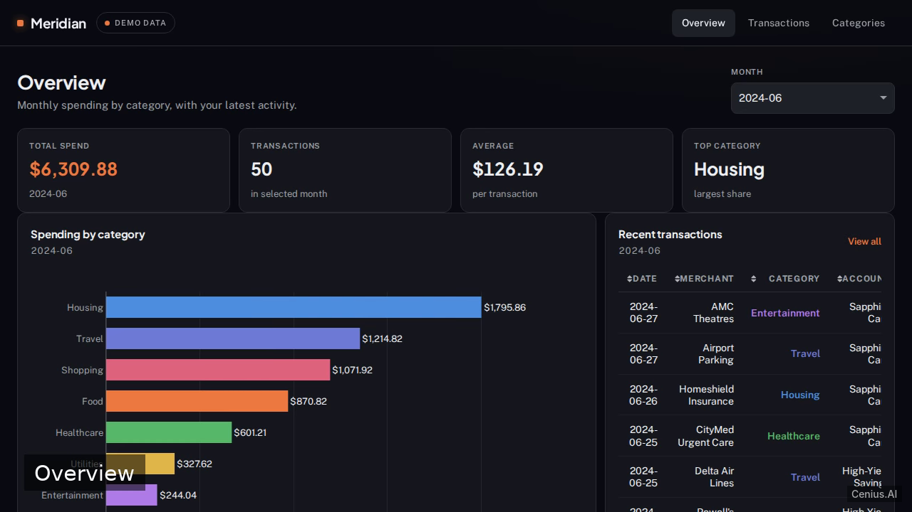
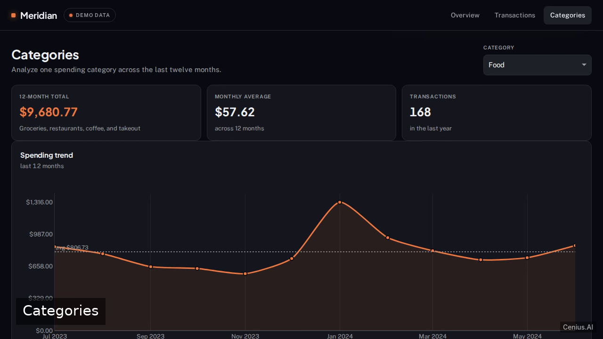

# Meridian — Personal Finance Dashboard — complete Full-stack app expense personal finance tracker example app

**Meridian — Personal Finance Dashboard** is a production-grade expense personal finance tracker written in Full-stack app — generated by cenius.ai, Apache-2.0-licensed. We'll build Meridian, a dark-themed personal finance dashboard in Plotly Dash that displays monthly spending by category and a searchable, filterable transactions table. Clone Meridian — Personal Finance Dashboard, run the installer, done — you have a working product in minutes. Want to change something? [Open Meridian — Personal Finance Dashboard on cenius.ai](https://cenius.ai/marketplace/p/meridian-personal-finance-dashboard?ref=gh&utm_campaign=meridian-personal-finance-dashboard-webapp) and say what you need — a revised build ships back, ready to deploy.


[](LICENSE)  [](https://cenius.ai)

[](https://cenius.ai/marketplace/p/meridian-personal-finance-dashboard?ref=gh&utm_campaign=meridian-personal-finance-dashboard-webapp)

> **▶ [Open & edit in cenius.ai](https://cenius.ai/marketplace/p/meridian-personal-finance-dashboard?ref=gh&utm_campaign=meridian-personal-finance-dashboard-webapp)** — one click to an editable workspace: describe changes in plain English, get an instant preview, one-click deploy and host. Modifications made on the platform come with full rebrand & relicense rights.

_Local clone? See [Quick start](#quick-start) below. cenius.ai is the zero-setup path._

## Demo


📽 **[Demo video on cenius.ai](https://cenius.ai/marketplace/p/meridian-personal-finance-dashboard?ref=gh&utm_campaign=meridian-personal-finance-dashboard-webapp)** — the complete run-through · [MP4](.github/media/demo.mp4)

## Screenshots

  

## Quick start

```bash
./install.sh   # installs dependencies + seeds demo data
```

See [`INSTALL.md`](INSTALL.md) for full setup and usage instructions.

## Architecture

Full-stack app project, delivered as a complete runnable codebase (40 files). Top-level layout: `assets/`, `components/`, `data/`, `pages/`. `install.sh` takes care of packages and initial data in a single pass; nothing else is required before launching. Installation walkthrough: [`INSTALL.md`](INSTALL.md).

## Features

- Monthly spending by category chart
- Transactions table
- Multi-page navigation and responsive shell
- Seeded demo data experience
- Distinctive dark fintech visual identity
- Category deep-dive page

## Usage guide

Meridian ships with 600 read-only demo transactions so every screen is
populated on first paint. No login is required.

### Overview (`/overview`)

- The **month selector** defaults to June 2024, the latest full month.
- The **KPI strip** shows total spend, transaction count, average, and top
  category for the selected month.
- The **horizontal bar chart** lists category spend descending, with dollar
  labels and a hover tooltip showing transaction count and average.
- **Recent transactions** previews the newest eight rows for the month.

Changing the month updates the chart, KPIs, and preview together.

### Transactions (`/transactions`)

- **Search** matches merchant names and notes (case-insensitive).
- **Month** and **Category** filters narrow the table.
- Column headers for **Date** and **Amount** sort on click (ascending, then
  descending on the next click).
- The table paginates 25 rows per page and shows the total row count.
- **Clear filters** resets search and both dropdowns.
- An empty result set shows a reset action.

### Categories (`/categories`)

- The **category selector** defaults to Food.
- The **trend line** shows 12 months of monthly totals with a dotted average
  reference line.
- The summary strip shows 12-month total, monthly average, and count.
- A filtered **transactions table** lists that category's rows.

### JSON API

All endpoints are read-only and mounted on the same server:

_Full guide: [`USAGE.md`](USAGE.md)_

## FAQ

### How do I self-host Meridian — Personal Finance Dashboard?

Everything you need ships in this repo: clone it, run `./install.sh` to install dependencies and seed demo data, then follow [`INSTALL.md`](INSTALL.md) to start it. No external services required.

### What if I want to add features to Meridian — Personal Finance Dashboard without coding?

Describe what you want changed on [cenius.ai](https://cenius.ai/marketplace/p/meridian-personal-finance-dashboard?ref=gh&utm_campaign=meridian-personal-finance-dashboard-webapp) — no code editing needed; the platform produces a fresh build you can download and deploy.

### Is Meridian — Personal Finance Dashboard free for commercial use?

Yes. The code is Apache-2.0-licensed — use it, modify it, and ship it commercially. See [LICENSE](LICENSE).

### Can I rebrand or white-label Meridian — Personal Finance Dashboard?

Absolutely. [Open it on cenius.ai](https://cenius.ai/marketplace/p/meridian-personal-finance-dashboard?ref=gh&utm_campaign=meridian-personal-finance-dashboard-webapp) and remix it there — platform modifications come with full rebrand and relicense rights over your derivative, so the result is entirely yours.

### Which framework or language does Meridian — Personal Finance Dashboard use?

The app is built with Full-stack app. What you see in this repo is the full production source, demo data included. Highlights include multi-page navigation and responsive shell.

## License & rebranding

Released under the [Apache License 2.0](LICENSE) (© 2026 Cenius AI) — free for personal and commercial use. The Cenius name/logo are trademarks (see NOTICE).

**Need a customized version?** [Remix this app on cenius.ai](https://cenius.ai/marketplace/p/meridian-personal-finance-dashboard?ref=gh&utm_campaign=meridian-personal-finance-dashboard-webapp) — modifications made on the platform come with **full rebrand & relicense rights** over your derivative.

## Built with cenius.ai

This entire application — code, design, seeded demo data — was generated on **[cenius.ai](https://cenius.ai)** from a plain-English description.

- 🚀 [Build your own app on cenius.ai](https://cenius.ai)
- 🎛️ [Remix Meridian — Personal Finance Dashboard on the marketplace](https://cenius.ai/marketplace/p/meridian-personal-finance-dashboard?ref=gh&utm_campaign=meridian-personal-finance-dashboard-webapp) — open it in a workspace, prompt for changes, and ship your own version.

More open-source apps: [the Cenius-ai catalog](https://github.com/Cenius-ai) · [showcase index](https://github.com/Cenius-ai/showcase)
